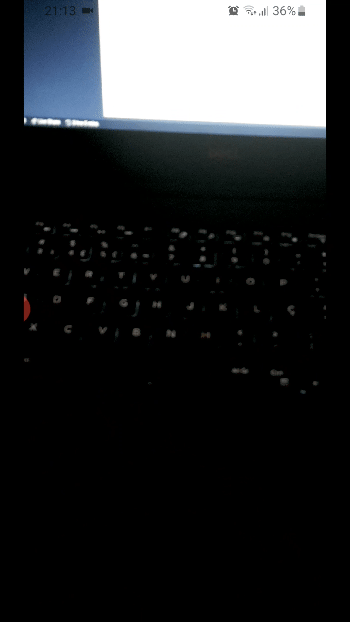

### Aplicativo de Realidade Aumentada para o MEGA HACK 2 - DESAFIO OLIST 🥳

#### Realidade Aumentada neutraliza a fonte das maiores dúvidas de compras em lojas online.

|  |  |  |  |
| :------------------: | :----------------------: | :----------------: | :----------------------: |
|        Carro         |     Mesa      |         TV         |         Relógio          |
  

## 1. Funcionamento

- Carro - Ambiente físico
- Mesa - Ambiente físico
- TV - Ambiente físico
- Relógio - Detecção de corpo humano

## 2. Execução
Download do APK `https://github.com/patrickbattisti/olist-augmented-reality/blob/master/olist-ar.apk` ou realização das seções <b>3. Configuração</b> e <b>4. Instalação  (Android)</b>.

## 3. Configuração

`git clone https://github.com/patrickbattisti/olist-augmented-reality.git`

`npm install` ou `yarn`

## 4. Instalação  (Android)

`npm run android` ou `yarn android`

